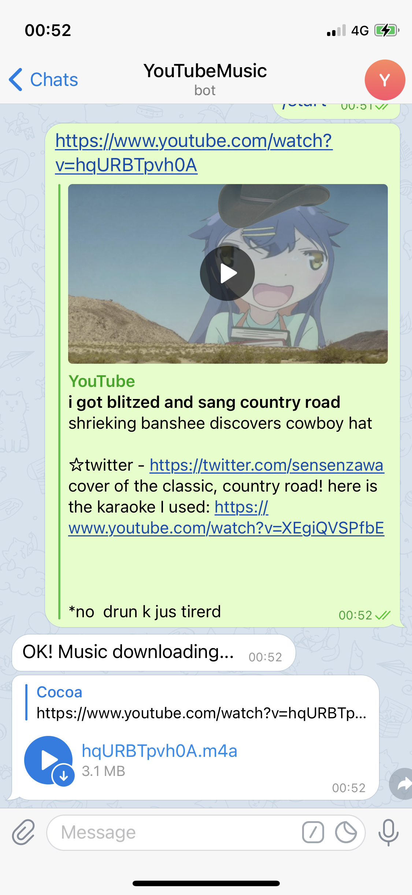

# youtube-music-bot
YouTube Music Bot for Telegram.

"OK, Google. Set telegram as YouTube music player"

### Compile
```bash
go build -ldflags "-s -w"
```

### Usage
1. Apply a Telegram bot and secure its token.
2. Copy `config.example.json` to `config.json`
   ```json
	{
	  "token": "XXXXXXXXXXXXXXXXXXXXXx",   # telegram bot token
	  "music_dir": "music",		      		   # music cache directory
	  "max_filesize": 33554432,			       # max single file size
	  "python3": "/usr/local/bin/python3", # python3 interpreter with youtube-dl module
	  "log_level": "info"				           # log level
	}
   ```
3. Run `youtube-music-bot`

### Screenshot

